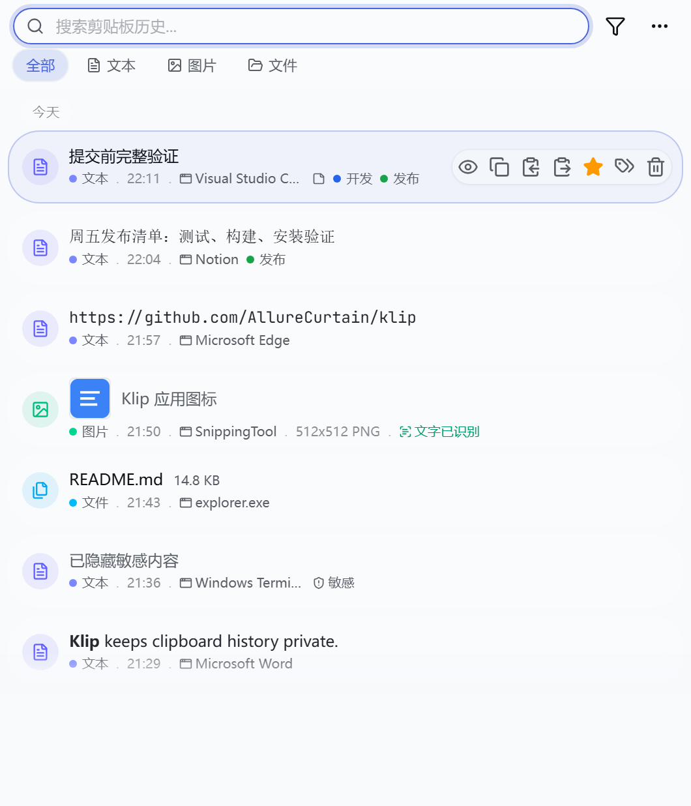
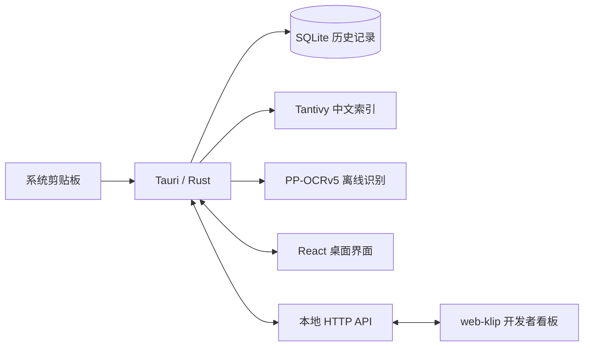

<p align="center">
  
</p>

<h1 align="center">Klip</h1>

<p align="center">
  <strong>把复制过的内容留在本机，需要时，一搜即得。</strong>
</p>

<p align="center">
  面向 Windows 的本地剪贴板管理器，记录文本、图片和文件，支持全文搜索、离线 OCR、快捷粘贴与隐私控制。
</p>

<p align="center">
  <a href="https://github.com/AllureCurtain/klip/actions/workflows/ci.yml"></a>
  <a href="https://github.com/AllureCurtain/klip/releases/latest"></a>
  <a href="https://github.com/AllureCurtain/klip/releases"></a>
  <a href="LICENSE"></a>
  
  
</p>

<p align="center">
  <a href="https://github.com/AllureCurtain/klip/releases/latest"><strong>下载 Windows 版</strong></a>
  · <a href="#快速开始">快速开始</a>
  · <a href="#功能一览">功能一览</a>
  · <a href="#本地开发">本地开发</a>
  · <a href="#文档">文档</a>
</p>

<p align="center">
  <picture>
    <source media="(prefers-color-scheme: dark)" srcset="docs/assets/klip-main-dark.png">
    
  </picture>
</p>

<p align="center"><sub>当前界面预览，内容为示例数据。README 会跟随系统主题显示浅色或深色版本。</sub></p>

## Klip 是什么

系统剪贴板通常只记住最后一次复制。Klip 在后台保存近期剪贴板历史，让写作、开发、资料整理和重复录入不必反复回到原始页面。

它目前专注于一个范围清楚的 Windows MVP：**复制、记录、搜索、找回、粘贴**。应用不要求账号，不包含云同步；历史记录、搜索索引和 OCR 模型均保存在当前电脑。

| 项目状态 | 当前情况 |
|---|---|
| 最新公开版本 | [`v0.1.2`](https://github.com/AllureCurtain/klip/releases/tag/v0.1.2) |
| 当前代码基线 | `v0.2.0` 发布候选 |
| 主要平台 | Windows 10+ |
| 产品形态 | 本地单机桌面应用 |
| 数据存储 | SQLite + 本地全文索引 |
| 账号 / 云上传 | 不需要 / 不包含 |
| 项目阶段 | 核心闭环完成，暂不继续扩大功能面 |

> `v0.2.0` 已完成代码、CI、桌面 E2E 和候选安装包构建验证，目前仍是 draft release。公开前还需完成干净 Windows 用户或虚拟机上的安装、自启动和升级验收。

## 为什么是 Klip

| | 设计取向 | 带来的体验 |
|---|---|---|
| **本地优先** | 历史和图片不发送到云端 | 不登录也能使用，数据边界更容易理解 |
| **键盘优先** | 全局唤起、搜索即输入、数字键快速粘贴 | 尽量少打断当前工作 |
| **不只存文本** | 文本、富文本、图片和文件统一管理 | 同一个入口找回不同类型的内容 |
| **中文可搜索** | Tantivy + jieba 全文检索 | 中文词组、标题、备注和 OCR 文本均可命中 |
| **隐私可控制** | 暂停监听、临时隐私模式、敏感内容策略 | 在方便和克制之间由用户决定 |
| **数据可带走** | JSON / CSV 导入导出、数据库备份恢复 | 本地迁移和故障自救不依赖服务端 |

## 快速开始

### 安装

1. 前往 [GitHub Releases](https://github.com/AllureCurtain/klip/releases/latest) 下载 Windows 安装包。
2. 安装并启动 Klip；程序会驻留在系统托盘。
3. 复制任意文本、图片或文件，然后按 `Ctrl+Alt+K` 打开历史窗口。

当前安装包尚未绑定公开代码签名证书，Windows 可能显示 SmartScreen 或“未知发布者”提示。这是现阶段的已知分发边界，不代表 Klip 需要联网或登录账号。

### 使用

1. **复制**：在任意应用中正常复制，Klip 自动记录内容。
2. **找回**：按 `Ctrl+Alt+K` 唤起窗口，直接输入关键词。
3. **缩小范围**：按文本、图片、文件、收藏、标签或日期筛选。
4. **粘贴**：点击条目，或按 `Ctrl+Alt+1` 至 `Ctrl+Alt+9` 快速粘贴前 9 条可见记录。
5. **整理**：为常用内容添加收藏、标签、标题或备注，也可以保存为片段。

| 默认快捷键 | 作用 |
|---|---|
| `Ctrl+Alt+K` | 显示或隐藏 Klip |
| `Ctrl+Alt+1` 至 `Ctrl+Alt+9` | 粘贴当前列表前 9 条可见记录 |

窗口快捷键可以在设置中修改为 `Ctrl+Alt+<A-Z>`。快速粘贴目前固定使用 `Ctrl+Alt` 加数字键。

## 功能一览

### 捕获与展示

- 自动记录文本、图片和文件剪贴板内容，相同内容自动去重。
- 默认保留 100 条历史，可在设置中调整。
- 文本可同时保留纯文本、HTML 和 RTF，粘贴时交给目标应用选择支持的格式。
- 图片在本机使用 PP-OCRv5 识别中英文，识别结果可直接参与搜索。
- 文件条目展示文件名、类型、数量和大小，并提供打开、定位与复制路径等操作。
- 列表按本地自然日分组，支持浅色、深色与跟随系统主题。

### 搜索与整理

- 基于 Tantivy + jieba 的中文全文搜索。
- 支持文本、图片、文件、收藏、标签、敏感内容、精确匹配与日期范围筛选。
- 自定义标题、备注和图片 OCR 文本都进入同一套搜索语义。
- 支持收藏、标签、批量收藏、批量打标签和批量删除。
- 可维护常用命令、短语和模板片段。
- 搜索索引异常时可从 SQLite 自动重建，并在不可用时回退到 SQLite 匹配。

### 粘贴与窗口

- 全局快捷键显示或隐藏主窗口，应用关闭窗口后继续在托盘运行。
- 点击条目可以恢复并粘贴，也可只复制、复制纯文本或粘贴纯文本。
- Klip 打开前会记住外部前台应用，粘贴时尝试恢复焦点。
- Windows 使用前台窗口句柄；macOS 和 Linux 已有部分基础实现，但不属于当前发布承诺。

### 隐私与数据

- 默认遮罩已识别的敏感内容预览。
- 可选择跳过密码、密钥和高熵 Token 等疑似敏感文本。
- 可随时暂停监听，或开启 15 分钟隐私模式。
- Windows 支持按进程名或窗口标题设置来源忽略规则。
- 支持 JSON / CSV 导入导出，以及 SQLite 数据库备份与恢复。
- 恢复前会自动备份当前数据库；损坏数据库会被保留以便排查。

## 数据放在哪里

Klip 的核心数据流完全在本机完成：



| 内容 | Windows 默认位置 |
|---|---|
| 数据库 | `%APPDATA%\com.klip.app\klip.db` |
| 全文索引 | `%APPDATA%\com.klip.app\search-index` |
| OCR 模型缓存 | `%APPDATA%\com.klip.app\ocr-models` |

OCR 模型随安装包提供，运行时不下载模型，也不上传图片。仓库中的 PP-OCRv5 模型约 21.5 MB，Windows ONNX Runtime 约 14.1 MB；它们是离线 OCR 的运行依赖，并非误提交的构建产物。来源、许可证和校验信息见 [OCR 资源说明](src-tauri/resources/ocr/README.md) 与 [ONNX Runtime 说明](src-tauri/resources/onnxruntime/README.md)。

Klip 当前**没有提供数据库静态加密**。如果电脑本身不可信，请配合 BitLocker、受保护的 Windows 账户和敏感内容跳过策略使用。

## 当前边界

README 中出现配置、接口或代码基础，不等于对应能力已经成为公开产品承诺：

| 能力 | 当前状态 |
|---|---|
| Windows 10+ 桌面核心工作流 | 当前重点，已完成自动化验证 |
| Linux 完整体验（X11 会话） | 已支持并通过真实桌面验收（Ubuntu 22.04/24.04）；Wayland 会话为降级支持 |
| macOS 完整体验 | 有部分代码基础（焦点恢复、无错误降级），尚未完成真实桌面验收 |
| 云同步、账号与团队共享 | 不包含 |
| 插件运行时与插件市场 | 不包含 |
| 托管更新源与应用内自动更新 | 不包含 |
| 数据库静态加密与密钥管理 | 不包含 |
| 公开代码签名 | 尚未配置 |

当前阶段优先处理真实 Windows 使用反馈，以及复制、搜索、粘贴、快捷键、托盘、隐私状态、备份恢复和设置保存的回归问题。

## 开发者看板与 API

Klip 在 `127.0.0.1:27717` 提供本地 HTTP API、SSE 事件流和 OpenAPI 3.1 描述。仓库中的 [`web-klip`](web-klip/README.md) 是独立的浏览器开发者看板，可用于检查历史、搜索、标签、片段、来源规则、统计、事件和 API 行为；它不是当前桌面安装包的一部分。

HTTP 服务仅监听回环地址，不启动桌面界面也能用 curl/脚本操作。`src-tauri/src/bin/klip_http_check.rs` 提供无桌面的独立服务用于本地验证，它由 `http-check-bin` feature 门控，**不随安装包分发**——该二进制会对任意指定的数据目录提供完整生产路由，而访问令牌默认关闭，打包出去等于让本机任意进程无凭据读取剪贴板历史。需要时显式构建：

```bash
cd src-tauri && cargo run --bin klip_http_check --features http-check-bin -- <DATA_DIR> <PORT>
```


- 剪贴板列表/搜索/详情，图片条目按需加载原图与缩略图（列表不再传 base64；缩略图带磁盘缓存与 `ETag`/`If-None-Match` 304）。
- 图片 OCR：查看状态、手动触发、失败返回明确错误（桌面 worker 不可用时 503）。
- 流式问答（SSE）：答案逐帧到达，引用可点击跳回原条目；失败/超时有明确帧。
- 自诊断面板：SQLite 完整性、搜索索引一致性、数据目录占用，可导出 JSON 报告。
- 主窗口只读状态（位置/尺寸/可见性）。
- 可选访问令牌（`http_access_token` 配置）：开启后全路由含 SSE 需 `Bearer` 头或 `?access_token=` 查询参数，缺失/错误一律 401；默认关闭，行为不变。

```powershell
# 先运行 Klip 桌面端
pnpm tauri:dev

# 在另一个终端启动开发者看板
cd web-klip
pnpm install --frozen-lockfile
pnpm dev
```

看板默认访问 `http://127.0.0.1:27717`，自身开发地址为 `http://localhost:5173`。完整端点与覆盖情况见 [HTTP 路由审计](docs/HTTP_ROUTE_AUDIT.md)。

## 本地开发

### 环境要求

- Node.js 24.x
- pnpm 10.x
- Rust 1.95+
- Windows 桌面 E2E 额外需要 `tauri-driver` 和与 WebView2 匹配的 EdgeDriver

### 启动与验证

```powershell
pnpm install --frozen-lockfile
pnpm tauri:dev
```

常用检查：

```powershell
pnpm test -- --run     # 前端单元测试
pnpm lint              # ESLint
pnpm build             # TypeScript + Vite 生产构建
pnpm verify            # 前端、构建、Rust fmt、Clippy 与 Rust 测试
pnpm e2e               # Windows 桌面端到端测试
```

建议为开发实例隔离数据、日志和 HTTP 端口，避免污染日常使用的数据：

```powershell
$env:KLIP_DATA_DIR = 'C:\tmp\klip-dev\data'
$env:KLIP_LOG_DIR = 'C:\tmp\klip-dev\logs'
$env:KLIP_HTTP_PORT = '27718'
pnpm tauri:dev
```

安装依赖时会配置仓库的 pre-push hook；推送前自动执行 `pnpm verify`。更完整的环境、调试和 E2E 说明见 [开发指南](docs/DEVELOPMENT.md)。

Windows 上可选用 `sccache` 加速重建依赖。它不是项目依赖，不需要修改仓库内 Cargo 配置：

```powershell
scoop install sccache
$env:RUSTC_WRAPPER = 'sccache'
sccache --show-stats
```

`sccache` 主要帮助 target 缓存未命中或 worktree 重建后的依赖编译；日常修改项目代码仍主要依靠 Cargo incremental。

### 在 Linux 上构建

系统依赖（Ubuntu/Debian，Tauri 2 的 webkit2gtk-4.1 是 webview 后端，appindicator3 是托盘）：

```bash
sudo apt-get update
sudo apt-get install -y \
  libwebkit2gtk-4.1-dev libgtk-3-dev librsvg2-dev libsoup-3.0-dev \
  libjavascriptcoregtk-4.1-dev libayatana-appindicator3-dev \
  build-essential curl wget file libxdo-dev libssl-dev pkg-config \
  xdotool xclip xsel
```

> `libwebkit2gtk-4.1-dev` 在 Ubuntu 22.04 (jammy-updates) 和 24.04 源中均可用，无需第三方 PPA。
> 粘贴模拟需要 `xdotool`（X11）；Wayland 下可另装 `ydotool` 或 `wtype`。

构建运行：

```bash
pnpm install --frozen-lockfile
pnpm build
cd src-tauri
cargo build
# 直接运行 debug 二进制（OCR 模型/ONNX Runtime 通过 CARGO_MANIFEST_DIR 回退加载）
KLIP_DATA_DIR=$HOME/.local/share/klip KLIP_LOG_DIR=$HOME/.local/share/klip/logs \
  DISPLAY=:0 ./target/debug/klip
```

打包（生成 deb/AppImage 等，`tauri.linux.conf.json` 会自动并入，把 Linux ONNX Runtime 纳入 bundle）：

```bash
pnpm tauri:build
```

Linux 桌面 E2E（需要一个 X11 会话；headless 环境用 Xvfb 或 Xvnc）：

```bash
cargo install tauri-driver --locked   # 已在 PATH 中
SKIP_BUILD=1 DISPLAY=:0 bash scripts/run-e2e-linux.sh
```

Rust 工具链：当前用 1.97.0/1.98.0 stable 验证通过。注意 rustc 1.98.0 在某些环境下编译 `quote 1.0.x` 会触发 ICE（`no type-dependent def for method call`），如遇到请改用 1.97.0。

## 发布验证

Windows 发布前常用命令：

```powershell
pnpm release:readiness
pnpm release:verify -SkipBundle
pnpm release:verify
pnpm release:smoke
```

`pnpm release:readiness` 只检查签名和更新源配置是否存在，不验证真实证书，也不会访问托管更新源。

可用的发布环境变量：

| 变量 | 用途 |
|------|------|
| `KLIP_WINDOWS_CERTIFICATE_THUMBPRINT` | 使用系统证书存储中的代码签名证书 |
| `KLIP_WINDOWS_CERTIFICATE_PATH` | 使用本地 PFX 证书文件 |
| `KLIP_WINDOWS_CERTIFICATE_PASSWORD` | PFX 证书密码 |
| `KLIP_WINDOWS_TIMESTAMP_URL` | 签名时间戳服务 |
| `KLIP_UPDATE_FEED_URL` | 后续更新源配置 |

## 技术栈

| 层 | 技术 |
|---|---|
| 桌面框架 | Tauri 2 |
| 前端 | React 19、TypeScript、Vite 6、Tailwind CSS 4 |
| 状态管理 | Zustand |
| 后端 | Rust |
| 数据库 | SQLite、rusqlite |
| 全文搜索 | Tantivy、tantivy-jieba |
| 剪贴板 | clipboard-rs |
| 图片 OCR | oar-ocr、PP-OCRv5、ONNX Runtime |
| 测试 | Vitest、Testing Library、Selenium WebDriver |

## 仓库结构

```text
klip/
|-- .github/       # CI、桌面 E2E 与 Release workflows
|-- docs/          # 产品、架构、数据库、API、发布与路线图文档
|-- e2e/           # 真实桌面剪贴板流程测试
|-- scripts/       # Git hook、驱动安装、发布与安装包验证脚本
|-- src/           # React 桌面界面
|-- src-tauri/     # Rust 后端、Tauri 配置、图标和离线 OCR 资源
`-- web-klip/      # 基于本地 HTTP API 的独立开发者看板
```

这些目录都在当前构建、测试、发布或文档链路中使用。`src-tauri/resources/` 体积较大是有意为之：Windows 安装包需要它实现完全离线的图片文字识别。

## 文档

| 文档 | 适合什么时候看 |
|---|---|
| [文档索引](docs/INDEX.md) | 不确定从哪里开始时 |
| [交付状态](docs/DELIVERY_STATUS.md) | 查看已合并工作、验证证据与保留边界 |
| [产品需求](docs/PRD.md) | 核对 MVP 范围和验收口径 |
| [架构设计](docs/ARCHITECTURE.md) | 理解前端、Rust、数据库和 Tauri 模块 |
| [数据库设计](docs/DATABASE.md) | 查看表结构、迁移和恢复策略 |
| [API 文档](docs/API.md) | 查看 Tauri IPC 命令、事件与类型 |
| [开发指南](docs/DEVELOPMENT.md) | 搭建环境、调试和运行检查 |
| [发布检查清单](docs/RELEASE_CHECKLIST.md) | 准备新的 Windows Release 时 |
| [路线图](docs/ROADMAP.md) | 判断下一项需求是否应进入当前阶段 |
| [版本记录](CHANGELOG.md) | 查看各版本变化 |

## 参与项目

欢迎通过 [Issues](https://github.com/AllureCurtain/klip/issues) 报告真实使用问题，也欢迎提交小而清晰的 pull request。开始前请阅读 [CONTRIBUTING.md](CONTRIBUTING.md)。

当前更需要的是核心工作流缺陷、测试补强、Windows 安装体验和文档准确性；大型跨平台扩展、云服务、插件系统和账号体系暂不进入 MVP。

## 许可证与致谢

Klip 基于 [MIT License](LICENSE) 开源。

感谢 [Tauri](https://tauri.app/)、[React](https://react.dev/)、[Rust](https://www.rust-lang.org/)、[clipboard-rs](https://crates.io/crates/clipboard-rs)、[Tantivy](https://github.com/quickwit-oss/tantivy) 与 [PaddleOCR](https://github.com/PaddlePaddle/PaddleOCR) 等项目提供的基础能力。
